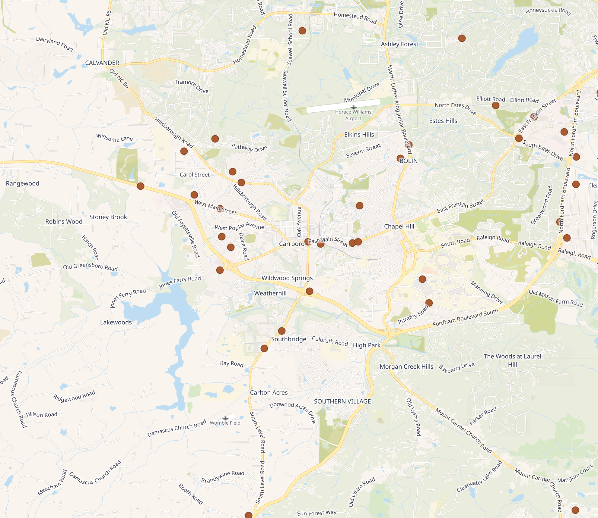
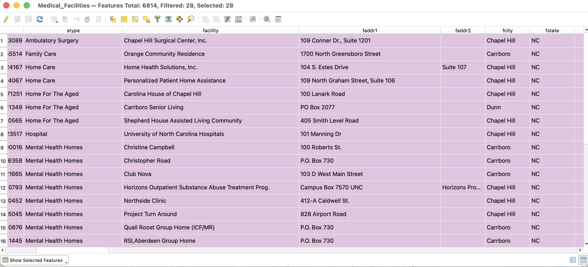
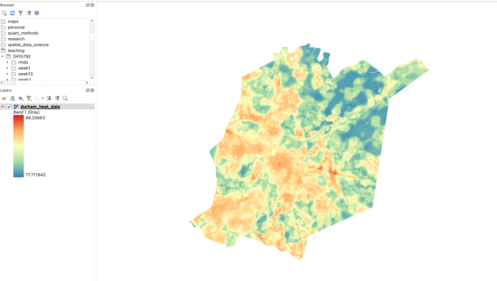
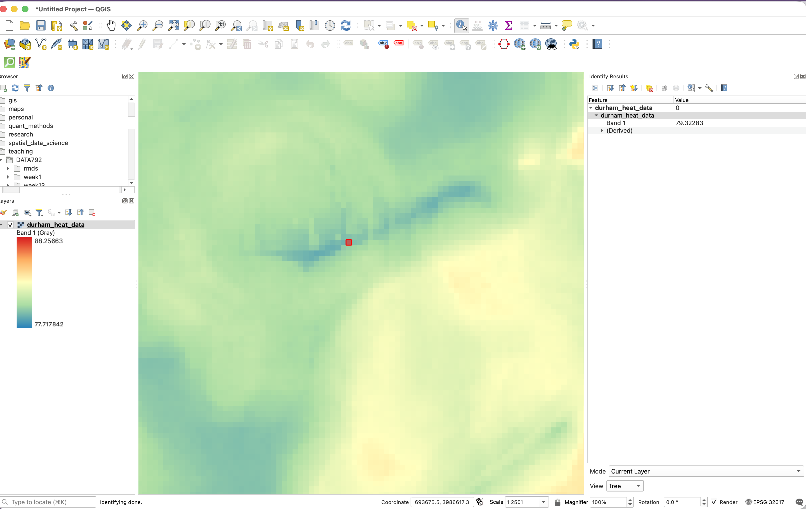

# Understanding Attributes

Remember that both of our spatial data models include both the object (location) and attributes associated with the location. The attributes represent the additional information that we have about each feature.

Attributes can take many forms- some are numbers, some are words, some might be dates. Understanding how this data is represented is essential for doing analysis correctly.

Each attribute has:

-   A field type (how QGIS is reading the data), and
-   A level of measurement (how we can interpret or analyze the data)

## Field Types

Every attribute field in a table has a *field type*, which determines what kind of data can be stored in that column. The field type affects how QGIS stores, displays, sorts, calculates, and analyzes the data. When you open a dataset, QGIS automatically detects the field type for each field. Common field types include:

-   Boolean – Yes/No, True/False, 1/0, etc.
-   Whole Number (Integer)
-   Whole Number (Integer - 64 bit)
-   Decimal Number – Double precision (i.e., numbers with decimals)
-   Date
-   Time
-   Date and Time
-   Text

## Levels of Measurement

A field type tells QGIS how data are stored. A level of measurement tells you what the values mean and what kinds of analysis make sense:

-   Nominal - Categories that can't be ranked (e.g., pharmacy name)
-   Ordinal - Categories that can be ranked (e.g., small/medium/large)
-   Interval - Numbers with an arbitrary zero (e.g., temperature)
-   Ratio - Numbers with a true zero (e.g., number of employees)

Levels of measurement and field types are connected, but they are not the same thing. Confusing them can lead to major problems when analyzing your data. The field type tells QGIS how to store and read the data (as text, numbers, dates, etc.), while the level of measurement tells you how the data should be interpreted and what kinds of analysis are appropriate. 

The level of measurement determines what types of analysis you can do on the data. 

-   Nominal- Frequencies, Mode
-   Ordinal- Frequencies, Median, Mode, Ranking
-   Interval- Addition, Subtraction, Mean, Median, Mode, Standard Deviation
-   Ratio- All arithmetic operations, mean, median, mode, percent change, normalization. 

The field type controls what QGIS can do, but the level of measurement determines what you should do. Sometimes, the two don’t match, which can cause problems.

For example, numbers stored as text won’t behave like numbers. Even if a column looks numeric, QGIS won’t let you sort, filter, or calculate with it unless the field type is numeric. A column of income values stored as text won’t sum correctly and might sort alphabetically (e.g., 100, 1000, 200).

Other times, the field type allows operations that don’t make sense. Categorical data is often stored as numbers- like 1 for pharmacy, 2 for clinic, 3 for hospital. QGIS will let you average or sum those values, but that’s meaningless. The numbers are labels, not quantities.

That’s why it’s essential to check both how the data is stored and what the data represents.

## Attributes in Vector Datasets

In vector datasets, attribute information is stored in the **attribute table.** An attribute table is a tabular dataset, meaning that it is made up of rows and columns. Each row corresponds to a feature (and each feature gets only one row). Each column contains information about that feature.

Let’s look at an example of vector data showing medical facilities in Carrboro and Chapel Hill. If you open the file in QGIS, you'll see the location of each pharmacy displayed on the map.

{width="347"}

If you open the attribute table, you’ll see all the other information we have about these locations. These attributes include things like the type of facility, the name of the facility, the address, etc.

For vector data, each feature is assigned a unique ID by the GIS software. This identifier helps keep the dataset organized and is essential for tasks like joining tables, running queries, or performing spatial analysis.

## Attributes in Raster Datasets

For raster data, each pixel represents one or more values that correspond to an attribute or measurement for that location. Most raster data is single-band, meaning each pixel stores a single value representing an attribute. Raster attributes can be stored as either integers or floating-point numbers. Even rasters representing categorical data (for instance, land cover) are encoded using numeric values. In these cases, you need a legend or a value lookup table to interpret what each pixel value represents. This is another good example of categorical data being stored as numeric values, reinforcing the importance of knowing your level of measurement as well as your data type.

Unlike vector data, rasters **do not** have an attribute table because each cell's location and attribute value are stored together in the grid. Instead, you interact with raster attributes in QGIS by examining pixel values, adjusting symbology, classifying values into categories, and performing raster analyses.

Let's look at an example of raster data representing average summer temperature in Durham, NC

Using the layer legend, we are able to see general patterns in the attribute. Instead of opening an attribute table, we can use the identify tool in QGIS to see individual pixel values

## Manipulating Attributes

Some of the most common tasks in a GIS analysis involve manipulating attributes. Attribute manipulation allows you to explore patterns in your data, identify features that meet specific criteria, combine information from multiple datasets, and create new variables for analysis.

One common operation is a **query**, which selects features based on attribute values. For example, you might select all counties with a population greater than 100,000 or all parks larger than 50 acres. Queries allow you to focus on a subset of features that meet your analytical needs.

Another frequently used operation is a **join**, which combines attributes from two tables based on a shared field. For example, you might join census data to county boundaries using a shared county identifier.

You can also **create new attributes** by calculating values from existing fields. Examples include calculating population density from population and area, computing the percentage of land covered by forest, or creating categories based on continuous values.
