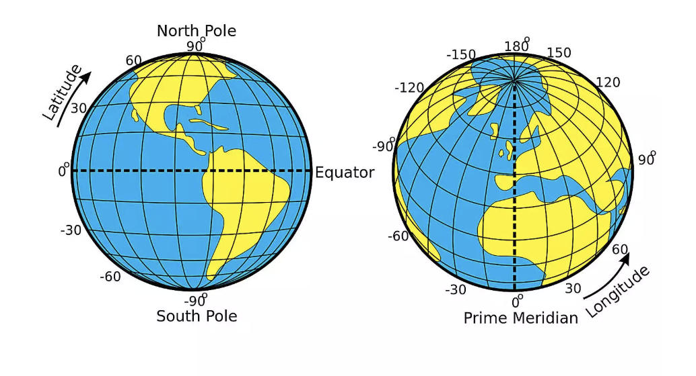
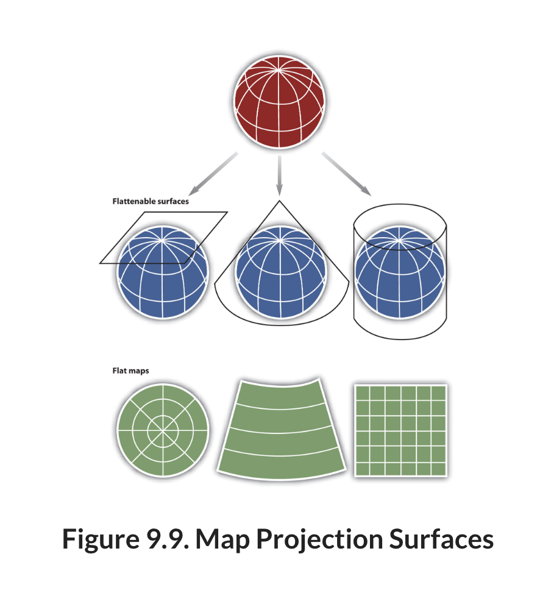

# Coordinate Systems and Projections

## What are Coordinate Systems?

A coordinate system is a framework for describing the location of features on the Earth's surface. It assigns a distinct set of coordinates to every location on Earth.

GIS uses two major types of coordinate systems:

- Geographic Coordinate Systems (GCS) describe locations on the Earth's curved surface using latitude and longitude.
-  Projected Coordinate Systems (PCS) describe locations on a flat plane using X and Y coordinates measured in linear units such as meters or feet.

## What are Geographic Coordinate Systems?

A geographic coordinate system describes locations on the Earth's surface using latitude and longitude. These coordinates are measured on a three-dimensional model of the Earth.

{width="569"}

Latitude measures how far north or south a location is from the Equator. Longitude measures how far east or west a location is from the Prime Meridian. Latitude ranges from 90° South at the South Pole to 90° North at the North Pole. Longitude ranges from 180° West to 180° East. Latitude and longitude are measured in degrees, not in feet or meters. Degrees measure angles rather than distances.

### Datums

A geographic coordinate system is built on a datum, which defines the size, shape, and position of the Earth used to calculate coordinates. Although we often think of the Earth as a sphere, it is actually slightly flattened at the poles and has an irregular shape. To simplify coordinate calculations, GIS uses a smooth mathematical model called an ellipsoid. A datum defines the ellipsoid used and how it is positioned relative to the Earth. Because different datums use slightly different ellipsoids and positioning, the same latitude and longitude coordinates can represent slightly different locations depending on the datum.

Two datums are especially common in GIS:

- WGS84 (World Geodetic System 1984) is the global datum used by GPS receivers, smartphones, and most online mapping services such as Google Maps.
- NAD83 (North American Datum of 1983) is widely used by federal, state, and local agencies throughout the United States and is the standard datum for much of the GIS data used in North Carolina.

## What are Projected Coordinate Systems?

Geographic Coordinate Systems are not good for measuring distance, area, or direction. This is because geographic coordinate systems use angular units (degrees of latitude and longitude) rather than linear units such as meters or feet. Most GIS analyses (and spatial analysis tools) assume that coordinates are measured in consistent linear units. Degrees do not meet this requirement because the linear distance represented by one degree changes depending on where you are on the Earth. For example, one degree of longitude is approximately 69 miles at the Equator but becomes progressively smaller toward the poles.

Therefore, most GIS analyses use

To solve this problem, GIS uses projected coordinate systems (PCS). A projected coordinate system transforms the Earth's curved surface into a flat coordinate system with X and Y coordinates measured in linear units, such as meters or feet. This transformation is called a map projection.

All projections involve using a developable surface (which is a surface that can be flattened to a plane) and "projecting" the earth onto that flat plane.

{width="462"}

It is mathematically impossible to perfectly represent the Earth's surface on a flat map (you can't simply convert from 3D to 2D). As a result, every map projection introduces some amount of distortion. This distortion increases as you move farther from the point or line where the developable surface touches the Earth. Projected Coordinate Systems are designed to minimize one or more properties, including:

- Area – preserving the true size of features.
- Shape – preserving the local shape of features.
- Distance – preserving distances between locations.
- Direction – preserving angles or directions.

No single map projection can preserve all of these properties everywhere on Earth. Instead, the best projection depends on the purpose of the map and the geographic area being studied. To minimize distortion, you should choose a projection that is designed for your study area (a projection designed for somewhere else on the globe will have a high degree of distortion) and that preserves the property most important to your analysis.

Several projected coordinate systems are commonly used for GIS work in North Carolina.

- North Carolina State Plane (NAD83) was designed specifically for North Carolina and minimizes distortion across the state.
- Universal Transverse Mercator (UTM) divides the Earth into 60 north-south zones, each with its own projected coordinate system. Most of North Carolina falls within UTM Zone 17N, while the far western part of the state extends into Zone 16N.

# When to Reproject Your Data

The coordinate system of a dataset is determined by the organization that created it. You will encounter both GCS and PCS in common geographic data sources. However, you can convert a dataset to a different coordinate system depending on your project. This process is called reprojection.

Although QGIS can display layers with different coordinate systems together using on-the-fly projection, many spatial analyses are more accurate and easier to perform when all datasets use the same projected coordinate system.

Some common reasons to reproject your data include:

1.  You need to measure distance or area. Geographic coordinate systems use angular units (degrees of latitude and longitude), while most GIS analyses require linear units such as feet or meters.

2.  Your datasets use different coordinate systems. While QGIS can display layers with different coordinate systems in the same project, it is good practice to reproject your datasets into a common coordinate system before performing spatial analysis. This helps ensure that all layers align correctly and that analysis results are consistent.

3.  You want to minimize distortion in your study area. Many projected coordinate systems are designed for specific geographic regions. For example, the North Carolina State Plane Coordinate System minimizes distortion across North Carolina, making it a good choice for projects conducted within the state.

4.  Your analysis requires preserving a particular spatial property. Every map projection introduces some distortion, but different projections preserve different properties. For example, if you are calculating the area of property parcels, an equal-area projection will produce more accurate area measurements than a projection designed to preserve shape.

## Reprojecting vs. Assigning a Coordinate System

One of the most common sources of confusion for new GIS users is the difference between reprojecting a dataset and assigning a coordinate system.

Reprojecting transforms a dataset from one coordinate system into another. During this process, the coordinates are recalculated and a new dataset is created. Reproject a layer when you want to perform analysis in a different coordinate system or ensure that all datasets use the same coordinate system.

Assigning (or defining) a coordinate system does not change the coordinates stored in the dataset. Instead, it tells QGIS how to interpret the existing coordinates. You should only assign a coordinate system when you know the dataset was created in that coordinate system but the coordinate system information is missing or incorrect.
