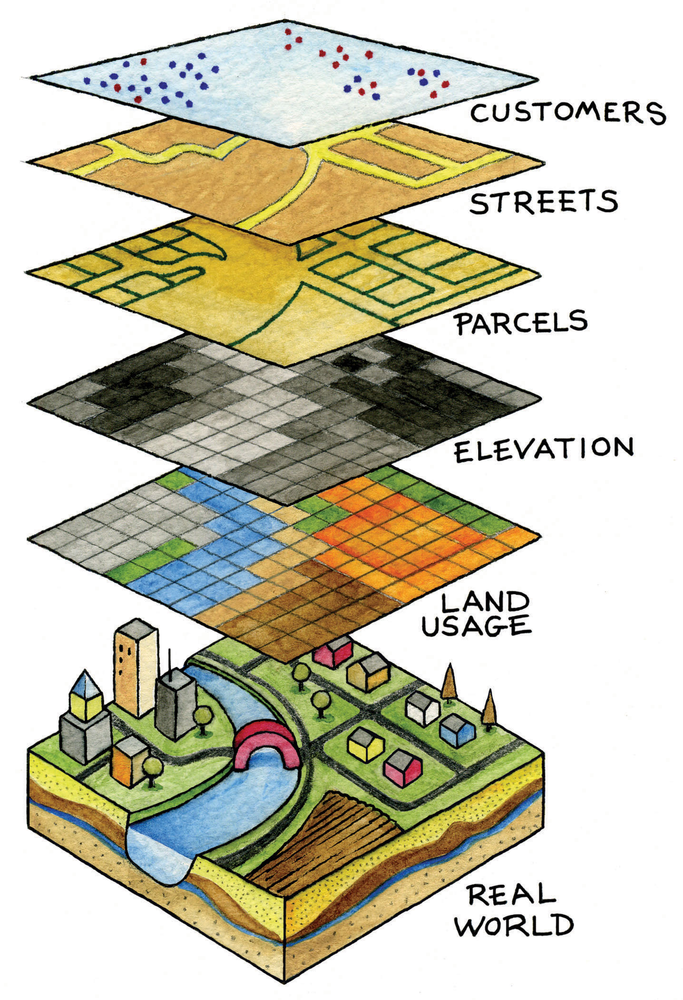
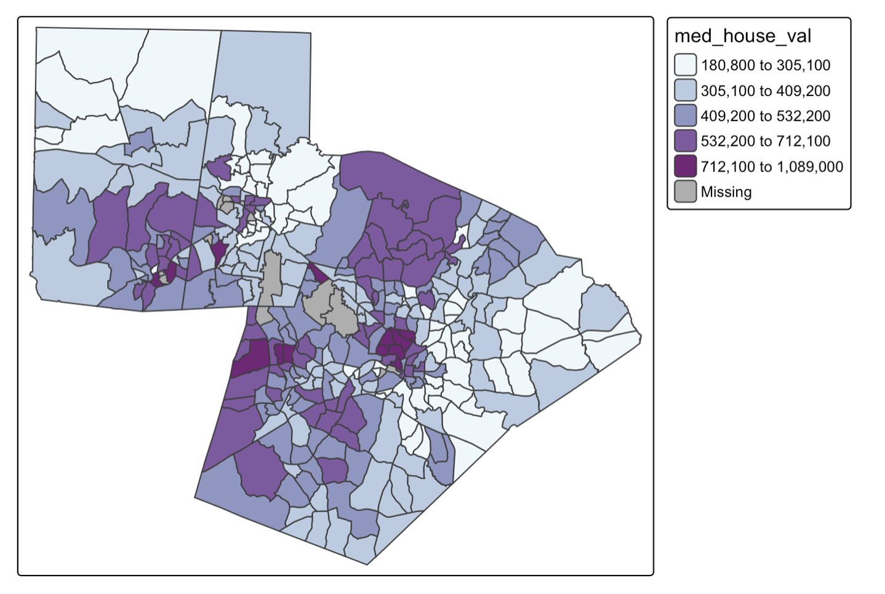

# Thinking Spatially

Many disciplines study people, places, and environments. Therefore, it is not the subject matter that differentiates geography from a field like Environmental Science or Sociology, but rather, the guiding framework. Geography is distinctive because it focuses on how relationships in space influence how the world works.

Geography begins with the fact that where something occurs often matters. The location of a hospital influences who can access healthcare. The location of a factory influences exposure to pollution. The location of a business influences its customers. The location of a wetland influences patterns of flooding and biodiversity.

A geographer looking at housing prices, disease outbreaks, wildfires, or demographic change in a city asks a set of surprisingly similar questions:

- Where is it located?
- What pattern does it form?
- Why does that pattern exist?
- What are the consequences of that pattern?

The goal of Geographic Information Science is to develop methods for answering these questions using spatial data.

## What is a Geographic Information System

One common method for exploring spatial questions (using geographic data) is a Geographic Information System (GIS). A GIS is an integrated framework for exploring spatial questions. It is built around combining hardware, software, data, people, and methodologies to analyze space. In this course, we’ll use GIS as a tool to help us examine geographic data, but the focus is not on learning GIS software in depth. Rather, we’ll use it to support broader learning about geographic information and spatial thinking.

|  |  |
|------------------------------------|------------------------------------|
| Component | Description |
| Hardware | Physical infrastructure used for GIS. This includes local computers, servers, data collection devices, etc. |
| Software | Applications and platforms used to analyze, visualize, and manage geographic data.  |
| Data | Data suitable for analysis in a GIS requires a locational component |
| People | Users, developers, analysts, and decision-makers who interact with GIS. |
| Methodologies | Techniques that are implemented inside a GIS to process data and answer spatial questions.  |

### The Layer Model

The most basic unit of geographic information is a feature. A feature is any object, event, or phenomenon that has a location. Features can represent a wide variety of things. A building, road, tree, river, census tract, wildfire, or weather station can all be represented as features in a GIS.

Features are then typically organized into layers. A layer is a collection of similar features representing a particular type of geographic phenomenon. For example, a city GIS database might contain separate layers for roads, parcels, streams, schools, and parks. Layers allow us to organize geographic information and examine relationships between different aspects of the landscape.

{width="396"}

## Core Spatial Concepts

### Location

Location describes where something is. Location can be described in **absolute** terms (e.g. latitude and longitude coordinates), or in **relative** terms (e.g. next to campus). GIS is fundamentally built around location. Every feature in a GIS dataset has a location that allows it to be mapped, analyzed, and related to other features.

### Distance

Distance describes how far apart features are. Distance influences movement, interaction, accessibility, and many other geographic processes. Because distance shapes how locations influence one another, it is one of the most important concepts in geography.

Geographer Waldo Tobler summarized this idea in what became known as the First Law of Geography: "Everything is related to everything else, but near things are more related than distant things." This principle suggests that nearby locations often exert stronger influence on one another than distant locations. Consider the spread of influenza through a city. Neighborhoods near an outbreak are generally more likely to experience infections than neighborhoods located farther away because people interact most frequently with those who are nearby.

This tendency for interaction to decrease with increasing distance is known as distance decay. Distance decay occurs because distance introduces costs. Traveling farther generally requires more time, money, effort, or energy. As these costs increase, interactions often become less frequent. For example, most people regularly visit nearby grocery stores because they are easier to reach.

### Distribution

Distribution refers to the arrangement of features across space. Features may be clustered, dispersed, or randomly distributed. Recognizing spatial patterns is one of the central goals of spatial analysis. For example:

- Retail stores often cluster near major roads
- Trees in an orchard are intentionally dispersed at regular intervals
- The dispersal of seeds from a single plant is often random

### Spatial Relationships

Things do not exist in isolation across space. Instead, features are connected through spatial relationships. Important spatial relationships include:

- Proximity (near/far)
- Adjacency (sharing a boundary)
- Containment (inside/outside)
- Overlap
- Connectivity

These relationships allow GIS to answer questions like:

- Which neighborhoods are within a mile of a park?
- What buildings fall inside a floodplain?
- Which roads connect to a highway?

### Spatial Processes

Spatial processes are the mechanisms that create spatial patterns. Spatial patterns emerge because location, distance, proximity, or connectivity influence how a process operates.

Consider home values within a city. Housing prices are rarely distributed randomly across space. Instead, they are influenced by a variety of factors that operate geographically, such as accessibility to employment centers, proximity to parks and schools, neighborhood change, and local zoning regulations. Together, these processes create the spatial patterns we observe.

One common spatial process is **diffusion**, where something spreads from one location to nearby locations. Diseases often spread through contact between nearby individuals. New housing developments frequently stimulate additional development in surrounding areas. Because nearby locations often influence one another, diffusion commonly produces clustered spatial patterns.

Spatial patterns can also emerge from **environmental constraints**. Physical characteristics of the environment influence where activities can occur and how landscapes develop. Steep slopes may limit development, climate influences vegetation patterns, and water availability affects agricultural production. In these cases, the physical environment shapes the distribution of both human and natural phenomena.

Many spatial patterns are also produced by **social and economic processes**. People tend to live near employment opportunities, transportation infrastructure, family networks, and communities with similar social or cultural characteristics. Businesses often locate near customers, suppliers, and major transportation routes. These decisions create concentrations of population, economic activity, wealth, and land uses across space.

Finally, spatial patterns are frequently shaped by i**nstitutions and systems of governance**. Zoning regulations, school attendance boundaries, taxation districts, transportation investments, and protected areas all influence how people and resources are distributed. These policies create spatial differences that can persist for decades and significantly shape the landscapes we observe today.

## Spatial Is Special

### Spatial Dependence

Tobler’s First Law of Geography states that “everything is related to everything else, but near things are more related than distant things”. Spatial dependence arises because the value of a variable at one location is often influenced by nearby locations. Spatial dependence emerges as a result of spatial processes. Spatial dependence can be strongly positive (which results in a clustered pattern), weak (which results in a random spatial pattern), or strongly negative (which results in a dispersed pattern).

The map below shows median home value by census tract in the Triangle region of North Carolina. This is an example of areal spatial data. Looking at this map, we can determine that there are clear clusters of positive and negative values (i.e. median home value is more similar in nearer locations).

{width="576"}

In contrast, many species distributions, especially of territorial species, result in a dispersed spatial pattern. Individuals or groups maintain a certain distance from one another to reduce competition for resources such as food, nesting sites, or mating opportunities. Examples include wolves, foxes, and certain bird species, where each territory is spaced to minimize overlap with neighbors.

If spatial autocorrelation is weak, it means that nearby locations are not consistently similar or dissimilar. This can happen when the underlying process is essentially random, when the factors influencing it are not spatially structured, or when multiple processes with opposing effects cancel each other out. Measurement or scale issues can also weaken apparent spatial dependence; for example, aggregating data over large regions can mask local patterns, making the distribution appear random.

### Spatial Non-Stationarity

Spatial patterns are caused by a combination of non-spatial and spatial processes. A spatial process is a mechanism, or set of mechanisms, that operates through space. This means that the location, proximity, or connectivity of features matters for how the process operates (i.e. the process itself depends on spatial relationships). This differs fundamentally from a non-spatial process, in which the outcome is independent of location or spatial arrangement.

Taking our example of median home value, we could consider several potential spatial processes that contribute to the clustered spatial pattern, including proximity effects (the value of a home is influenced by nearby properties) and accessibility (homes closer to transit, downtown areas, or commercial hubs are often more valuable). However, the observed pattern is also influenced by non-spatial processes, such as home size, home age, construction quality, and the number of bedrooms.

An important characteristic of spatial processes is that they are often **non-stationary**. This means that the way a process operates can change across space, so the relationships, mechanisms, or effects observed in one location may not be the same in another. For example, home values in one part of a city may be influenced primarily by access to employment and public transit, whereas in another part they may be driven more by school quality or proximity to parks and other natural amenities. More generally, non-stationarity can mean that the same process has different effects in different places, or that entirely different processes are operating across the study area. Recognizing non-stationarity is crucial for spatial analysis because models that assume a single, uniform process operating everywhere (global models) may fail to accurately capture these spatially varying relationships.

### Scale Effects

Spatial processes also differ across scales. For instance, we can consider that there are spatial processes at the local, city, or state level that might influence home value. At the local level, processes such as neighborhood clustering of high-amenity areas, street connectivity, or proximity to parks can influence home values. At the city level, processes like zoning, transit accessibility, or distribution of commercial centers shape housing prices across neighborhoods. At the state or regional level, spatial processes include the distribution of economic hubs, in-migration, and regional commuting flow. Because spatial processes differ across scales, analysis must account for scale to accurately capture the mechanisms influencing space.

### Modifiable Areal Unit Problem

Individual (or point-level) spatial data is often aggregated to areal units. This happens for several reasons:

- Privacy
  - Aggregating data protects sensitive information about individuals by reporting only summary values for larger areas
- Data availability
  - Some data are only measured or published at aggregated levels
- Analytical convenience
  - Aggregating data reduces complexity and makes spatial analysis more computationally manageable
- Alignment with policy or planning units
  - Many decisions (for instance, in urban planning, public health, or transportation) are made at administrative or political boundaries

While aggregating data is often necessary or useful, it introduces the Modifiable Areal Unit Problem (MAUP), where the choice of spatial units (size or boundaries) can influence statistical results and spatial patterns. These results can change significantly depending on how the boundaries are drawn (zone effect) and how large or small the units are (scale effect).

Consider the summary statistics for percent poverty across North Carolina zip codes vs. counties to see the impact of the scale effect:

| Aggregation Unit | Mean  | Median | Min   | Max   | St. Dev |
|------------------|-------|--------|-------|-------|---------|
| Zip Code         | 25.33 | 23.76  | 0     | 100   | 13.82   |
| County           | 26.46 | 25.48  | 12.34 | 40.83 | 6.58    |

Aggregating data into larger units can smooth out local variation and reduce variability. For example, comparing the standard deviation at the zip code (13.82) to the county (6.58) shows that smaller units capture more heterogeneity.

Because of the MAUP, we need to be careful when interpreting aggregated data, given that patterns observed at one scale or within a particular zoning scheme may not hold at another. Since spatial patterns are often scale-dependent, one way to mitigate the effects of the MAUP is to align the selection of areal units with the hypothesized scale of the underlying process
