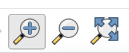
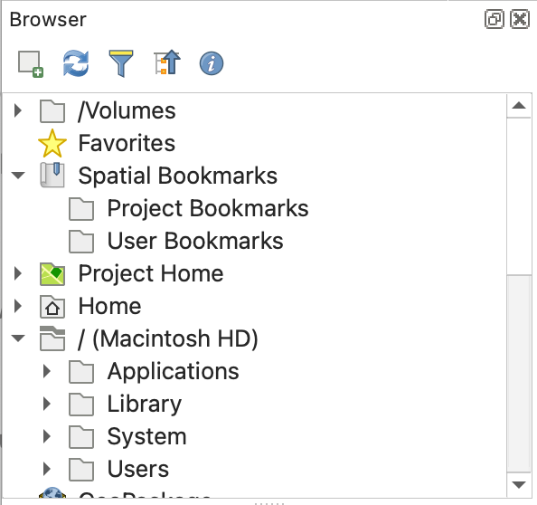

# QGIS 101

These videos introduce you to the basic tasks in QGIS. You can pair these with the more specific videos below

[QGIS Interface 101](https://drive.google.com/file/d/13Mx6sHg2dcK4bRNluGdWaXijAvll1D3C/view?usp=drive_link)

[Adding Data 101](https://drive.google.com/file/d/1qw1uVrfXBEctCqhFOAfIssKzSSidXSGl/view?usp=drive_link)

[Symbology 101](https://drive.google.com/file/d/11qON-7N0iBLX1E1fAtoalWSrV7Zdh057/view?usp=drive_link)

[Attributes 101](https://drive.google.com/file/d/1e7MO-Gh6ar0359k5P8U9tH2dapmDL_vZ/view?usp=drive_link)

[CRS 101](https://drive.google.com/file/d/1nHMEkLnqSPVCxMOuUqjVNJAaEgkodTxU/view?usp=drive_link)

[Saving 101](https://drive.google.com/file/d/1BMF8qc9WMJph3YmMTvMNwaHoFhlSLoOy/view?usp=drive_link)

[Print Layout 101](https://drive.google.com/file/d/1o_Fy_XgrJg1G3ahgo4shCtLc5x02amt2/view?usp=drive_link)

# QGIS Basics

Before any sort of analysis and visualization can take place, you must be extremely comfortable with creating projects, opening files, working with attributes, loading basemaps, and basic symbolization. Think of this chapter as your hands-on introduction to the essential building blocks of working with spatial data in QGIS. The sample data used in this chapter can be found [here](https://drive.google.com/drive/folders/1WlGwOCwi5vfk65u1vKmz7zg1UoeVhi9-?usp=sharing). Download the folder, unzip it, and add the contents to your GEOG370/lab/lab_1/raw_data folder. The data we will use is:

-   North Carolina census block group boundaries
-   North Carolina census block group tabular data (attributes)
-   Maximum temperature at weather stations across North Carolina during a heatwave in June 2024
-   Orange County elevation

## Explore the Dataset

Start by looking in the data folder and answering the following questions:

-   How many files are there?
-   Which file likely corresponds with each of the datasets above?
-   What is the file format of each of the datasets? Is it a spatial data type or a non-spatial data type?
-   Can you open the file outside of QGIS? What does the file look like?

## [Start a Project](https://drive.google.com/file/d/1Uvnk4HwNXV1a_o1Gn7muASwmoUlD7h_B/view?usp=sharing)

Every time you begin a new lab or analysis, you’ll create a new QGIS project file.

This .qgz file stores the structure of your work: which layers you loaded, how you symbolized them, and what your map looked like when you last saved it. It’s like a snapshot of your workspace. QGIS projects do not store the data itself—they store file paths. If you move, rename, or delete your data after you’ve added it to a project, QGIS won’t be able to find it anymore. Always keep your data organized in a consistent folder structure.

## [Add a Basemap](https://drive.google.com/file/d/1n_IFHB4lNRib6TLDgQwMLuV8DzGvykFD/view?usp=sharing)

Once you’ve created a project, you typically want to add a basemap. **A basemap is a foundational map that provides geographic context for other data**. It is often a satellite image, topographic map, or streetmap.

We will use the QuickMapServices plug-in for our basemaps. I highly suggest using the OSM "VersaTiles" basemaps because they are optimized for printing. You can use the "Map Navigation Toolbar" to zoom in, out, or pan on your basemap.

## [Add Raster or Vector Data](https://drive.google.com/file/d/1tm3Oxl8vM-9ksbRIraNA2ZypMdc9lSjl/view?usp=drive_link)

Now that you have your project set up, you are ready to add some vector and raster data.

You will add two datasets: a raster representing elevation in Orange County, and a vector representing census block groups across North Carolina.

There are multiple ways to add data, **but the simplest way is to use the Browser panel**. [If you are missing your panels, watch this video.](https://drive.google.com/file/d/10be1iGWf4RApnKoFf3pflPVn_L_7NDBR/view?usp=sharing)

{width="194"}

## Working with Attributes

### [Explore the Data Properties](https://drive.google.com/file/d/1e5OoQJqwHo797F-dJmLvidP0Zl2sCxbM/view?usp=drive_link)

When you read in vector data (which is our census block groups), one of the first things you should do is explore the properties of the data, including looking at the data type of each of the fields, exploring the attribute table, and looking at summaries of important fields

For raster data you will want to look at the properties and look at a summary of the raster.

### [Add a Field to Vector Data](https://drive.google.com/file/d/1sTH8E9VOLuBCrdtLdnZdCkA_aerC5PgR/view?usp=sharing)

We often want to manipulate vector attribute data to create new attributes. In this case, we will calculate population density based on two existing fields- one representing population and one representing area (in square meters). We will use the formula: pop_density = total_population / (area/2589988) to calculate the number of people per square mile.

After you add a field, you must save the layer.

### [Selecting Features Based on Attributes](https://drive.google.com/file/d/1mBn6o-1Xg8gxrOmjKAmrooBjOxGrHOaZ/view?usp=drive_link)

We often want to isolate a subset of features based on an attribute. We can select features from an attribute and save those as a new layer.

We will isolate only census block groups with a population density over 100 people/ square mile.

### [Manually Selecting Features](https://drive.google.com/file/d/1khD08bewB8bUlRtjfV7DSbAmqcuS6Y10/view?usp=drive_link)

We can also manually select features using the attribute table.

## Basic Symbolization

Chances are, the symbolization that is automatically applied when you add your data into QGIS is not going to be sufficient. Symbology choices are some of the most important choices that you will make when creating maps. There are many symbology choices available in QGIS. You should symbolize your elevation and census data. Here are the basics of changing [vector](https://drive.google.com/file/d/1wNGbBzTUCbcYikbXFfq0yGKy1c6Fpqka/view?usp=drive_link) and [raster](https://drive.google.com/file/d/1-NHfbEljE4k6O6HD0UNmKYCOp0w04s8U/view?usp=drive_link) symbology

Explore these resources for more information:

-   [Lesson: Changing Raster Symbology](https://docs.qgis.org/3.40/en/docs/training_manual/rasters/changing_symbology.html)

-   [Lesson: Symbology](https://docs.qgis.org/3.40/en/docs/training_manual/basic_map/symbology.html)

## [Adding Tabular Data](https://drive.google.com/file/d/1FC5gqPed8LDbQr8q8MlVn1SwMJ-fsXhX/view)

Sometimes geospatial data comes in a tabular format. This means that the file is not already in a spatial format (usually it is a .csv), but you can add it into QGIS in a spatial format by pointing QGIS to the fields in the data that represent latitude and longitude and providing QGIS with the correct CRS of the data (this would be found in the metadata. In this case, I provide you with the correct CRS, which is EPSG:4326).

Using a CRS that does not match the latitude/longitude values means that your data will not be in the correct location. You can easily add tabular data that has a lat, lon fields by using the Data Source Manager. For this project, you will add in tabular data representing the maximum temperature at North Carolina ASOS stations (weather stations) during a June 2024 heatwave.

## [Executing Table Joins](https://drive.google.com/file/d/1ZnCF73LYXIcc1UljKbU5EZDv03mSltL_/view)

Finally, table joins are an absolutely essential pre-processing step for many spatial analyses. A table join involves joining tabular data and spatial data based on a **matching key**. For instance, you might have data about geographical locations (for instance, census block groups) but the data doesn't actually have the geometry information.

In this case, you could match census data to the census block group boundary file using a shared key (GEOID). For this to work in QGIS, it is required that the matching keys are exactly the same (which is often a problem) and are set as the same data type in QGIS.

For this project, you will add census block group data that represents median income and join this to your census block group boundary file. When you add tabular data, you **MUST use the Data Source Manager**.

# Cartography Basics

A map is the most common output of a spatial analysis. A map should be designed to deliver only the information needed in as simple a manner as possible. While this isn't a cartography class, there is a basic expectation that your maps will follow basic design principles and contain the required map components.

We will practice cartography basics by creating a well-designed map of high population density census block groups in the Triangle region of North Carolina

## Basic Design Principles

-   Features must use an [appropriate visual variable](https://colorado.pressbooks.pub/makingmaps/chapter/chapter-4-visual-variables/).
    -   If you are displaying quantitative data you should use value or size. If you are displaying categorical data you should use hue or shape.
-   Features must use an appropriate [classification scheme](https://colorado.pressbooks.pub/makingmaps/chapter/chapter-10-data-classification/) and an appropriate number of classes (usually between 4-7)
-   Color ramps should be appropriate
    -   Use a **single-color (sequential)** ramp for values that go from low to high (e.g., population density).
    -   Use a **diverging** ramp only when the data have a meaningful middle value (e.g., above and below zero).
    -   Use **different hues** to represent different categories (e.g., land cover types).
    -   Avoid colors that imply unintended meaning (e.g., red = danger).
-   If you use a basemap, important basemap features **MUST** be visible under the features
    -   **Basemaps are not required.** Only include a basemap if it provides useful geographic context or helps readers interpret the map.

    -   **Choose a basemap that supports the map's purpose.** For example, use a street basemap to show roads and place names, or a satellite basemap when land cover or imagery is important.

    -   If you are displaying areal data and using a VersaTiles basemap only the labels will appear over the features. If the labels aren't sufficient, add transparency to your features
-   The map must be appropriately zoomed and centered on the features
-   There should be a small amount of white space on the edges of the map, and the map should have a frameline
-   Additional map components (title, legend,etc.) should be appropriately sized
    -   Additional map components should never take attention away from the map features
-   Include only the map elements that are needed

## Required Components

-   Map
-   Title
-   Metadata (should include data source, CRS of the map, and author information)
-   Legend
    -   Legend items MUST be renamed if the legend name isn't clear
    -   You should not include any features in the legend that are not on the map
-   Frameline

# Making Our First Map!

-   [Choose appropriate symbology](https://drive.google.com/file/d/1hzFgRY6bSYwOTNI1Q29lLapocTVhQ3NQ/view?usp=drive_link)
    -   Note that I added a bit of transparency to the features so that you can see the basemap below
-   [Create a print layout](https://drive.google.com/file/d/1DdIEf-odt0aoy9fD3Epcpdj0UNdqX2wl/view?usp=drive_link)
-   [Add a map and frameline](https://drive.google.com/file/d/1lQ61lZBe9NIWmBRlNmiClS2cIrlszP6I/view?usp=drive_link)
-   [Rescale and center features](https://drive.google.com/file/d/1NkorI04Ih8QmgyBLAxB14fpFqwPr3HTH/view?usp=drive_link)
-   [Add legend](https://drive.google.com/file/d/1NTMJw5Ja6Usbx5GvgLO9ds6R518woeiv/view?usp=drive_link)
-   [Add scale bar](https://drive.google.com/file/d/1fcrx0V_eVOsfbp-rNg6vmMZyvesuZmge/view?usp=drive_link)
-   [Add title](https://drive.google.com/file/d/1g9Q8KFubaoox5_Z5Of6bCsPoDADeMTrL/view?usp=drive_link)
-   [Add metadata](https://drive.google.com/file/d/13Yglcnvrjx-PEF0PIAjLUDz7d5NinhRd/view?usp=drive_link)
-   [Save map](https://drive.google.com/file/d/1bHB5AmtdU3ykxPq22dN6jCOzzg4kjQCx/view?usp=drive_link)
