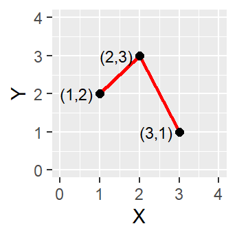
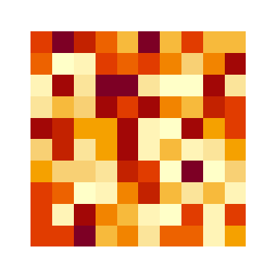

# Spatial Data Models

Data is not reality itself; it is a structured way of representing aspects of reality that can be physically observed and measured. A data model is a formal framework for representing spatially referenced information, simplifying physical entities and conceptualizing reality.

A spatial data model is designed to represent a set of features using two different components- objects and attributes. A object represents the **location**. Attributes store the **descriptive information** related to the object

## Conceptual Views of the World

When translating real-world features into geographic data, there are two main “conceptual” views of the world: the field view and the object view. A field view treats the world as a continuous surface, where each location is associated with one or more attributes. In contrast, an object view conceptualizes the world as made up of discrete entities that have clearly defined boundaries and exist in specific locations. Between these objects, there can be empty space with no associated features.

These conceptual models align with two major data models used in GIS. A vector-based model represents geographic features as sets of points, lines, or polygons. This is well-suited for discrete objects. A raster-based model, on the other hand, represents space as a grid of regularly spaced cells, each containing a value that represents an attribute at that location. This structure is ideal for continuous data, where each cell captures a small piece of a surface.

## Vector Models

Vector data is built around geometries, which are encoded into the file. The most basic geometry type is a point. A point is represented as a single coordinate pair (x, y).

Points can then be combined to create lines and polygons. To create a line, at least two distinct points must be connected

A polygon is created when three or more line segments are connected which means the starting and ending coordinate pairs must be the same. Of the three basic geometric primitives (point, line, polygon), only polygons have an area.

### Common Vector Data File Types

**Shapefile (.shp):** By far, the most common vector data file type you’ll encounter when accessing geospatial data is the Shapefile (.shp). This format, which is semi-proprietary (structured and maintained by ESRI), has become the dominant standard. This is not because it offers superior functionality, but because of ESRI’s early dominance in the GIS software market. Despite their ubiquity, shapefiles come with serious limitations: a maximum file size of 2 GB, field names limited to 10 characters, and a maximum of 255 fields. Many believe, myself included, that [Shapefile must die!](http://switchfromshapefile.org/)

A shapefile is actually a collection of files that work together to store geographic information. At a minimum, a shapefile consists of three required files. The `.shp` file stores the geometry of each feature, such as points, lines, or polygons. The `.shx` file stores an index that helps GIS software quickly locate and display those features. The `.dbf` file stores the attribute table associated with the features. Additional files are often included as well. The `.prj` file stores information about the coordinate reference system.

In a shapefie, the geometry (object) and attributes are stored separately. The `.shp` file contains the shapes themselves, while the `.dbf` file contains information about those shapes. GIS software links the geometry and attributes together using their order within the files. The first feature in the geometry file corresponds to the first row in the attribute table, etc.

This structure means that all of the files associated with a shapefile must remain together in the same directory. If one of the required files is deleted, renamed, or moved, the dataset will not work correctly.

**GeoPackage (.gpkg)**: GeoPackage is an open-source format developed by the Open Geospatial Consortium (OGC). Unlike a shapefile, which stores information across multiple separate files, a GeoPackage stores all geographic information within a single .gpkg file. Internally, a GeoPackage is built on SQLite, a lightweight [relational database system](https://www.ibm.com/think/topics/relational-databases). This means that geographic features, attribute tables, metadata, coordinate reference systems, and other information can all be stored together in one container.

Instead of storing a single layer, a GeoPackage can contain many layers within the same file. For example, a single GeoPackage might contain roads, parcels, streams, buildings, and land use data. Because everything is stored together, GeoPackages are easier to share and manage than shapefiles.

**GeoJSON (.geojson):** GeoJSON is a text-based format for storing vector geographic data. It uses JavaScript Object Notation (JSON), a format that is commonly used for web-based data. Because GeoJSON is stored as plain text, it can be opened and read in any text editor, making it one of the most transparent and portable geospatial formats.

Unlike shapefiles and GeoPackages, which use binary storage formats, GeoJSON stores coordinates and attributes directly in a human-readable structure. A simple example is:

{\
"type": "Feature",\
"properties": {\
"name": "Old Well"\
},\
"geometry": {\
"type": "Point",\
"coordinates": \[-79.0478, 35.9120\]\
}\
}

## Raster Models

In a raster model, real-life features are represented as an array of pixels. Instead of distinct geometries, a raster is made up of regularly spaced pixels of identical sizes, and each pixel is associated with a value. Unlike vector data, where geometry and attributes are stored separately, raster data stores attribute values directly within the grid. The location of each pixel is implied by its position in the raster and the raster's coordinate reference system.

### Common Raster Data File Types

**GeoTIFF (.tif)**: GeoTIFF is the most common raster format used in GIS. Like a standard TIFF image, it stores data as a grid of rows and columns, where each cell contains a value representing an attribute at that location.

Unlike vector data, which stores explicit coordinates for every feature, raster data stores geographic location implicitly. Rather than recording the coordinates of every pixel, a GeoTIFF stores information that allows the location of each pixel to be calculated. This includes the coordinate reference system, raster dimensions, cell size (resolution), and the geographic location of a reference point, typically the upper-left corner of the raster. A GeoTIFF stores this information directly within the TIFF file using embedded metadata tags.

**NetCDF (.nc)**: NetCDF (Network Common Data Form) is a format commonly used for storing large scientific datasets. Unlike a GeoTIFF, which typically stores a single raster layer, a NetCDF file can store multiple variables and dimensions within a single file. Internally, data are stored as multidimensional arrays, allowing information to vary across space, time, elevation, depth, or other dimensions. NetCDF files also store metadata describing variables, units, coordinate systems, and dimensions. Because of this structure, NetCDF is widely used for climate, weather, oceanographic, and environmental datasets.
