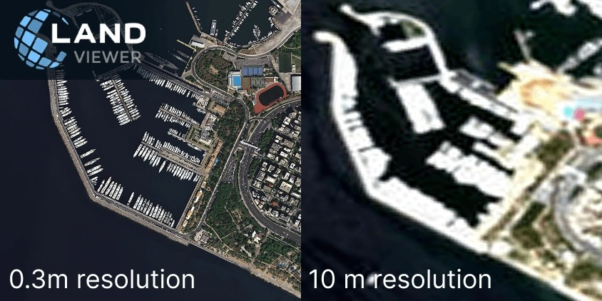
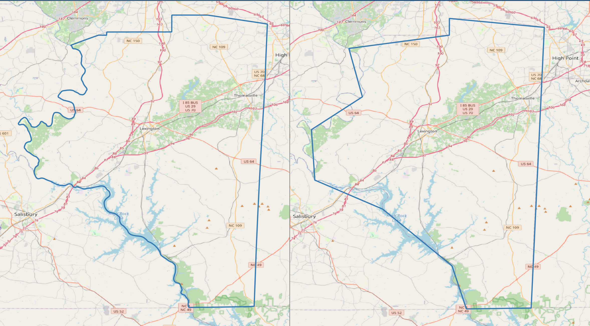
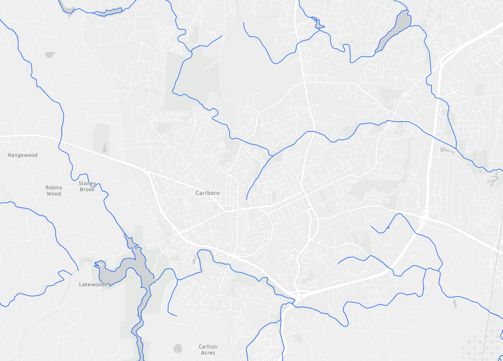

# Resolution in Geographic Data

Broadly, resolution determines how much betail we can see and analyze in our dataset. There are two main types of resolution in spatial data: spatial resolution defines the level of spatial detail in the dataset whereas temporal resolution refers to how often a dataset is refreshed.

High resolution data is much more expensive to produce and store. Therefore, we often don't have access to very high resolution geospatial data for free.

## Resolution in Raster Data

In raster data, resolution refers to the size of each pixel, typically expressed in ground units (e.g., feet or meters.). Smaller pixels mean higher resolution, capturing more detail. Most raster sources, such as satellite imagery, have fixed native resolutions determined by the sensor’s capabilities.

The images below show the same area at different spatial resolutions:

{width="438"}

With the left image, we can see individual boats, clearly delineate roadways, and identify individual buildings. With the right image, we can only get a general sense of different areas of the environment.

## Resolution in Vector Data

With vector data, resolution is defined by several conditions:

1.  The complexity of the shape (for instance, how many vertices are used to represent the feature)

For example, a low-resolution county boundary dataset might only show the general shape of the county by using fewer vertices, a high-resolution dataset might very closely mirror the true boundary of the county.

{width="435"}

2.  The minimum mapping unit (MMU). This represents the smallest feature that would be included in the dataset

For example, a high resolution dataset of streams might show every single minor stream in Carrboro, while a lower resolution dataset might only show named streams.

{width="402"}

## How to Choose the Right Resolution

We are often tempted to use the highest resolution data that we can access. However, choosing the right resolution is not as simple as higher is better. Too much detail can slow down workflows because of the increasing size of the data and lead to a mismatch between the data and the question being asked. For instance, using a highly detailed land cover dataset when you are only interested in broad, country-wide trends in land cover would be an ineffective use of high-resolution data.

Instead, resolution in GIS analysis is about finding the right balance between detail, scale, and efficiency. Thinking critically about what componenets of features you actually need in your analysis is a helpful way to help determine an appropriate resolution. Do you need every individual building, or is an outline of developed areas enough? Do you need every bend in the river or is a general river area enough? Do you need to be able to identify a car in the satellite imagery, or is being able to delineate the road enough?
